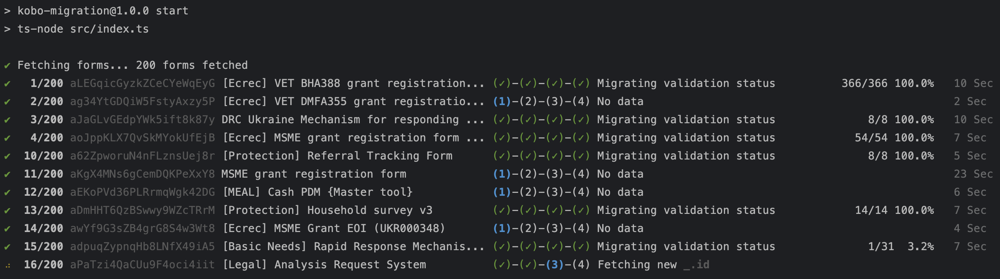
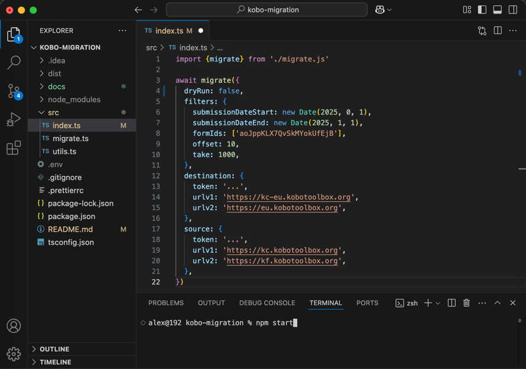

# kobo-migration

Transfer KoboToolbox submissions, including attachments and validation statuses, from one server to another.
- The process assumes the form already exists on the destination server. 
- Attachments will be renamed using the pattern `{form_id}_{submission_id}-{question}-{i}` to ensure they are properly recognized by Kobo.

This script uses the [kobo-sdk](https://github.com/DRC-UA/kobo-sdk), which abstracts the complexities of interacting
with the Kobo API. Feel free to use it to create your own custom scripts.



## Usage

### Prerequies

- Having [Node](https://nodejs.org/en) v16+ installer.
- Having an IDEA like [VSCode](https://code.visualstudio.com/) installed.

### Instructions

#### 1. Download the repository in your local machine and Unzip it

**[🔗 LINK](https://github.com/DRC-UA/kobo-migration/archive/refs/heads/main.zip)**

Alternatively, you can clone it using `git` if you're familiar with the process.

#### 2. Open the project with VSCode.

#### 3. Install project dependencies

Open VSCode terminal (menu Terminal > New Terminal) and type.

```aiignore
npm install
```

#### 4. Update settings

Open `src/index.ts` and update parameters.

- `dryRun` (optional): When set to true, this option simulates the migration without making any changes, allowing you to
  verify
  that everything will work as intended before applying the actual migration.
- `filters` (optional):
    - `submissionDateStart`: Filters submissions with `_submitted_at` later than the specified date.
    - `submissionDateEnd`: Filters submissions with `_submitted_at` earlier than the specified date.
    - `formIds`: Specify form IDs to migrate. If empty, the script migrates all forms on the server.
    - `offset`: The starting point for pagination. Use this to resume from where the script left off if it failed.
    - `take`: The max number of items to retrieve.
- `source|destination` (required):
    - `token`: Your private token, available in your account settings on the Kobo website.
    - `urlv1`: also named `kc url`.
    - `urlv2`: also named `kf url`.



#### 5. Run the script

From the terminal:

```aiignore
npm start
```


## Kobo Servers Index

| Server | V1 (kc)                       | V2 (kf)                    |
|--------|-------------------------------|----------------------------|
| EU     | https://kc-eu.kobotoolbox.org | https://eu.kobotoolbox.org |
| Global | https://kc.kobotoolbox.org    | https://kf.kobotoolbox.org |
| DRC    | https://kc-kobo.drc.ngo       | https://kobo.drc.ngo/      |